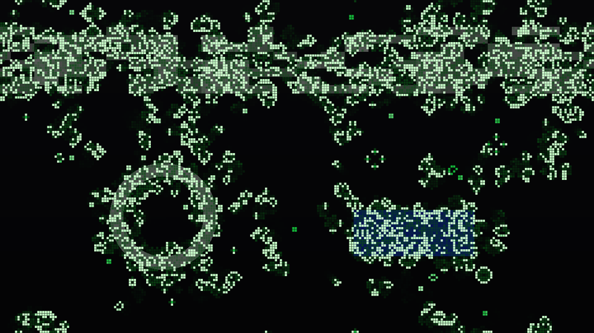

# conway

> **AI-assisted project.** This codebase was created with [Claude](https://claude.com/claude-code)
> (Anthropic), directed and reviewed by a human author. It has **never been
> loaded into Resolume**. It is loaded by [oxbow](https://github.com/stoatworks-labs/oxbow),
> a real FFGL host that is not Resolume, which reads both plugins' names, ids and types
> and renders 120 frames through each. Everything below is measured by an offline
> harness that drives the real plugin classes in a headless GL context, on this Mac's
> GPU at two rasters and again on Apple's software renderer. `cwtest --patterns` asks
> the plugin for the published facts of Life and gets them: the R-pentomino has **116
> cells at generation 1103** (118 at 1102) and through 1200, Diehard is **gone at 130**,
> Gosper's gun adds **a glider every 30 generations**, the oscillators come back at
> periods 2, 2, 2, 3 and 15 and not before, the glider moves (1,1) every 4 and the
> lightweight spaceship 2. `--reference` steps all thirteen rules on a torus and with
> dead edges for 64 generations and matches the harness's own stepper **bit for bit**,
> ages included. `--coverage` finds every pixel within float rounding of the live area
> it covers. `cwtest --negative` re-runs fourteen checks against deliberately wrong
> models, and `tools/mutate.sh` changes one character of the shipped shaders and code;
> every one is caught. A control sweep fails if any parameter does nothing.

Conway's Game of Life for Resolume Arena/Avenue, as two FFGL plugins: **SW
Conway**, a source that plays Life (and twelve of its relatives) from a soup or a
famous pattern, and **SW Conway Over**, an effect whose clip seeds the field and
keeps feeding it.

The source's defaults after ten seconds (generation 149): a 35% soup burning
down, newborn cells white, cells that have lived forty generations green, the
just-dead trailing. Rendered by the plugin's offline harness (`cwtest`), not
captured from Resolume.

## The one idea

**A grid of cells, each alive or dead, all updated at once by one rule that looks
only at the eight neighbours.** Conway's rule is B3/S23: a dead cell with exactly
three live neighbours is born, a live one with two or three survives, and every
other cell dies or stays dead. Nothing here is drawn as a picture of Life. The field
is an integer texture, one generation is one pass, and everything you recognise
falls out of the rule:

- **gliders** crawl diagonally, one cell every four generations, and **spaceships**
  run at twice that;
- **oscillators** blink at their periods: blinkers and beacons at 2, pulsars at 3,
  the pentadecathlon at 15;
- **Gosper's gun** fires a glider every 30 generations;
- **methuselahs** boil for a thousand generations from five cells (the R-pentomino)
  or seven (the acorn);
- a random **soup settles into ash**: still lifes, blinkers, and gliders wandering
  the torus until they hit something.

The same machinery runs the rest of the family by changing the rule: HighLife's
replicators, Day & Night's blobs, Seeds' explosions, Maze's corridors, Diamoeba's
amoebas, Anneal's slow melting, and two **Generations** rules (Brian's Brain, Star
Wars) whose dying cells take a generation or two to clear before anything can be born
there.

The look is the state. A cell's colour is its **age**, newborn to elder, so still
lifes (old) and the boiling front (young) read apart at a glance; a cell that has just
died glows for a few generations. And the field **reseeds itself** when it has settled:
the plugin counts every generation's live cells exactly and notices when the count has
been repeating.

In **SW Conway Over** the clip is the seed. Its bright cells are the live ones when the
field is seeded, and **Feed** keeps breeding cells wherever the clip stays bright, so
Life spills out of the picture's highlights and the rule takes it from there.

SW Conway Over on the harness's test card (a lit skyline, a ring, a saturated blue
sign) after ten seconds. Rendered by `cwtest`.

## Controls

- **Automaton:** Rule (*Conway*, *HighLife*, *Day & Night*, *Seeds*, *Life without
  Death*, *Maze*, *Replicator*, *Diamoeba*, *2x2*, *Morley*, *Anneal*, *Brian's Brain*,
  *Star Wars*), Edges (*Torus*: the field wraps; *Dead*: nothing past the edge).
- **Time:** Speed (0 pauses; 0.5–500 generations a second), Smooth (a crossfade from
  one generation into the next, as a share of its period), Step (one generation, by
  hand).
- **Seeding:** Pattern (*Soup*, *R-pentomino*, *Acorn*, *Diehard*, *Gosper Gun*,
  *Gliders*; the Over adds *Clip*), Density, Seed, Reseed, Auto Reseed (reseed when the
  field has settled), Noise (spontaneous births); the Over adds Threshold (how bright a
  part of the clip must be to be alive) and Feed (how often a bright cell is reborn,
  every generation).
- **Audio:** Audio (Resolume's FFT buffer), Audio Steps (generations per onset, 0–8:
  Life on the beat), Audio Seeds (a patch of soup per onset).
- **Look:** Cell Size (16 rows to a cell per pixel at 1080p; the field keeps its cells
  when you change it), Gap (dark space round each cell), Palette (*Phosphor*, *Heat*,
  *Ice*, *Mono*, *Spectrum*), Age Span (generations from newborn to elder colour),
  Trail (how long the just-dead glow); the Over adds Clip Colour (cells take the clip's
  colour), Backdrop (the clip behind the cells) and Mix.

The source is transparent where nothing lives, so it layers over the composition below
it.

## Status

**v0.1.0, built 4 October 2026, not released.** No user guide yet,
no OpenFX port, no repository on GitHub.

It has **never been loaded into Resolume**, on macOS or Windows. `oxbow probe` reads the
bundles as a host does (`SW Conway` / `LF01` / source, `SW Conway Over` / `LF02` /
effect) and `oxbow selftest` renders 120 frames through each. It has never been built
on Windows. Built and measured on macOS (Apple Silicon, M4 Max).

What is measured, on this machine, at 1280x720 and 320x180 on the GPU and at 320x180 on
Apple's software renderer:

| | |
| --- | --- |
| the literature | the harness's own stepper, on an unbounded plane under the shipped rule table's Conway, reproduces every published number first: R-pentomino 118 cells at 1102, 116 from 1103 to 1200; acorn 635 at 5205, 633 from 5206; Diehard 2 at 129, gone at 130; the gun +5 cells every 30 generations for 10 periods |
| the patterns, through the plugin | five still lifes still for 10 generations; blinker, toad, beacon p2, pulsar p3, pentadecathlon p15, each back at its period and not before; the glider translated (1,1) and the LWSS 2 cells after 4 generations, and the glider home on a 24x24 torus at exactly 96; the gun +5 every 30; Diehard gone at 130 on a torus and with dead edges; the R-pentomino 118 at 1102 and 116 at every generation 1103–1200 on a 640x640 torus |
| the family | Day & Night and Anneal: step( not x ) = not step( x ), 0 cells disagree in 20 generations; Life without Death: 0 deaths; Seeds: 0 survivals; Replicator: a 7x7 pattern is 8 copies at ±8 after 8 generations, 0 cells wrong; Brian's Brain: 0 survivals, 0 births straight after a death |
| every rule | 13 rules × torus and dead edges × 64 generations of soup on a 157x93 grid: identical to the harness's stepper, every cell's age and time since death included |
| population | the occlusion query's count equals the state's for every one of 301 generations |
| Auto Reseed | ash with a population period of 30 settles at generation 149 (window 120 + 30 − 1), period 30, exactly; an empty field at 7; the R-pentomino boils 1000 generations without settling |
| clock | from a host clock at 499,000,000 ms (a float resolves 32 ms there) every frame's dt is within 6×10⁻¹¹ s, and the generation count is floor( Speed × elapsed ) at every checkpoint; the clock law holds over 36,000 frames at 60, 23.976 and jittered rates |
| coverage | each pixel is the lit area it covers: worst 3×10⁻⁵ at 8-px cells with a gap, 1.6×10⁻⁴ at 7.42-px cells, 0 at half-pixel cells, each inside its bound from float edges |
| Over | Reseed from the clip makes exactly the cells whose centres are bright (2393 cells, 0 wrong, a saturated blue counted), not mirrored; Mix 0 returns the clip bit for bit; Feed 1 keeps every bright cell alive |
| resize | a resize of the same shape keeps the field bit-identical; 16:9 → 4:3 → 16:9 keeps the middle cell for cell and empties the margins |
| audio | the first frame after a clip trigger, loud, fires nothing; the next beat does (Audio Steps 2: two generations per onset) |
| GL state | viewport, vertex array, array buffer, program, unit, framebuffer, blend, scissor, clear colour, colour mask, ten texture units, both plugins |
| negative controls | **14** deliberately wrong models, **all 14** detected |
| mutants | **5** one-character changes (three GLSL, two C++), **all 5** caught |
| dead controls | **41** parameters over both plugins, all live |

The software renderer skips the two 640x640 methuselah runs (minutes each there;
`CWTEST_HEAVY=1` runs them) and says so; they repeat the step and count passes that
`--reference` and `--count` hold bit for bit on it.

Render cost (`cwtest --bench`, the median frame, on a machine shared with other
builds): **SW Conway 0.32 ms at 720p, 0.18 at 1080p, 0.37 at 4K; SW Conway Over 0.18,
0.26 and 0.71 ms**; at Cell Size 0 (1080 rows, two million cells) 0.19, 0.21 and 0.45
ms — 1–4% of a 60 fps frame. At 15 generations a second most frames run no
generation at all: the cost is the composite.

What is **not** verified, and is the honest limit of this build:

- **Never in Resolume**, on either platform, and never built on Windows: how its 24
  and 29 parameters present there, the clock unit, the FFT bins and real audio are
  untested in a host.
- **Auto Reseed is a heuristic.** It looks for a population that repeats exactly with a
  period of 30 or less for 120 generations. Ash, oscillators and gliders on a torus all
  do; a field with Noise never does, and a large field can take minutes to settle.
- **Counts arrive a frame or two late**, so in Resolume a reseed lands a generation or
  so after the field settled. The harness reads them at once to check the law exactly.
- **Threshold reads the brightest channel × alpha**, so a dim grey clip (Resolume's Beat
  003) seeds almost nothing at the default 0.5, and a bright one (IntoTheGlow_02) fills
  the field: lower or raise it for the clip.
- **At 500 generations a second below 16 fps** the automaton runs slower than Speed: a
  frame runs at most 32 generations and drops the rest rather than bursting.
- The colours and palettes are chosen by eye.

No OpenFX port yet.

## Browser demo

**<https://conway-demo.stoatworks-labs.com/>** — both plugins, their own
controls and defaults. The seed, copy, step, count and composite passes are the
plugin's own GLSL, spliced unedited into `demo/shaders.js`
(`demo/tools/check_shaders.py`, run by `tools/verify.sh`, fails on a changed
character). The CPU half — the generation clock, the buttons, the rule table
parsed from its notation, the RLE stamps, the grid and its centred re-grid, the
salts, Smooth's phase, the palettes and the settle law — is a JavaScript port in
`demo/plugin.js` that **nothing checks but a reader** (it was compared once with
`cwtest` and agreed cell for cell). WebGL2 has no exact occlusion query, so the
page counts the population by reading the plugin's count pass back. There is no
audio in a browser, so Audio, Audio Steps and Audio Seeds are absent; Step and
Reseed are toggles the page releases; Seed is a dropdown (0–99). The Over runs
on the page's generated clips. It is a demo, not the plugin, and the page says
what it does not reproduce.

## Build

C++17 + GLSL 4.10, CMake, FFGL 2.1 (SDK vendored as a submodule). macOS builds are
universal (arm64 + x86_64); Windows needs GLEW via vcpkg.

    git clone --recursive https://github.com/stoatworks-labs/conway
    cmake -B build -DCMAKE_BUILD_TYPE=Release
    cmake --build build
    cmake --install build          # both bundles into Resolume's Extra Effects

## Building and testing

The offline harness renders the real plugin classes headlessly:

    ./build/cwtest --out /tmp/life.png --frames 600     the source
    ./build/cwtest --over --out /tmp/over.png           the effect, on a night-street card
    ./build/cwtest --literature   the published numbers on an unbounded plane (no GL)
    ./build/cwtest --patterns     the same numbers, asked of the plugin
    ./build/cwtest --rules        the family's symmetries and laws
    ./build/cwtest --reference    every rule, both edges, bit for bit
    ./build/cwtest --count        the query's population is the population
    ./build/cwtest --settle       Auto Reseed when the law says
    ./build/cwtest --clock        Resolume's 499 million ms clock, in double
    ./build/cwtest --coverage     each pixel is the live area it covers
    ./build/cwtest --over-check   the clip's bright cells, not mirrored; Mix 0; Feed 1
    ./build/cwtest --prime        no audio event on the trigger frame
    ./build/cwtest --resize       the field survives a resize
    ./build/cwtest --state        the GL state handed back
    ./build/cwtest --settle-law --clock-law --cues --names   (no GL)
    ./build/cwtest --negative     every check above, against a wrong model
    ./build/cwtest --offline      the no-GL subset and its negative controls (what CI runs)
    tools/mutate.sh               one character changed, a check must fail
    python3 tools/sweep.py        no control is silently dead
    ./build/cwtest --bench        720p through 4K, both plugins
    tools/verify.sh               all of it, the software renderer too, in about two minutes

Filming uses the fleet's frame format and cue sheets:

    ./build/cwtest --pipe --frames 1800 --size 1280x720 --script cues.txt \
      | ffmpeg -f rawvideo -pix_fmt rgba -s 1280x720 -r 60 -i - life.mp4
    ffmpeg -i clip.mov -vf fps=60 -f rawvideo -pix_fmt rgba -s 1280x720 - \
      | ./build/cwtest --over --pipe --size 1280x720 \
      | ffmpeg -f rawvideo -pix_fmt rgba -s 1280x720 -r 60 -i - over.mp4

<!-- attributions:start -->
This project is built on other people's work — see [ATTRIBUTIONS.md](ATTRIBUTIONS.md).
<!-- attributions:end -->

## Licence

MIT.

The Game of Life is John Horton Conway's (1970, published by Martin Gardner in
*Scientific American*); the patterns are the Life community's, in their standard RLE.
Nothing is copied from anyone's source.
