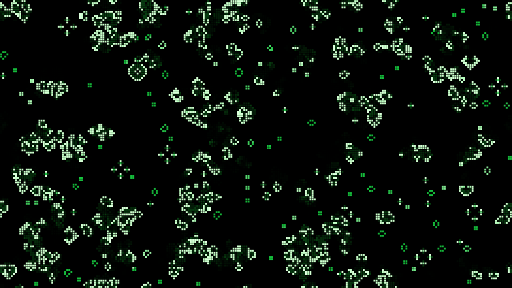

# Conway user guide

Conway is **Conway's Game of Life, for [Resolume](https://resolume.com) Arena and Avenue**, as
two FFGL plugins in one download: **SW Conway**, a source that plays Life (and twelve of its
relatives) from a random soup or a famous pattern, and **SW Conway Over**, an effect whose clip
seeds the field and keeps feeding it. Nothing is drawn as a picture of Life. A grid of cells
runs the rule, one generation at a time, and everything you recognise falls out of it: gliders
crawling across the frame, blinkers and pulsars, a gun firing gliders, a soup boiling and then
settling into still shapes.



*SW Conway at its defaults after ten seconds (generation 149), rendered by the offline harness
rather than captured from Resolume: a 35% soup burning down, newborn cells white, cells that
have lived forty generations green, the just-dead trailing.*

> **Before you rely on this:** released at **v0.1.0**, and honestly early. The automaton is
> measured rather than asserted, by a harness that drives the real plugin classes headlessly, at
> two rasters and on a software renderer. It asks the plugin for the published facts of Life
> and gets them: the R-pentomino has 116 cells at generation 1103 (118 at 1102), Diehard is gone
> at 130, Gosper's gun adds a glider every 30 generations, the oscillators come back at periods
> 2, 3 and 15 and not before, the glider moves one cell diagonally every four generations and
> the lightweight spaceship two cells across. All thirteen rules match an independent stepper
> cell for cell for 64 generations, on a torus and with dead edges, every cell's age included;
> Day & Night and Anneal are symmetric under swapping live and dead, as published. Every pixel
> is the live area it covers, to within float rounding. Fourteen deliberately wrong models are
> each shown to fail their check, one-character mutations of the shipped shaders are caught,
> and all 41 parameters over both plugins are shown to change the picture.
> It has **never been loaded into Resolume on macOS** — the one host it has run in there is the
> fleet's own test host, `oxbow`, for 120 frames each.
> On Windows both plugins have been loaded: a build of this source loads, registers and renders in Resolume Arena 7.27.1 on software rendering (win-lab, Mesa llvmpipe, no GPU, no sound device), with every control matching what the plugins declare (24 and 30 host controls), Arena's log clean, in the fleet's Arena gate: 15 of 15 checks, the audio rows skipped. Because the field changes every generation, no two grabs of the picture are alike, so the gate could confirm only some controls one at a time: all 14 of the source's valued controls and 7 of the effect's, the rest inconclusive (none dead). The harness's own sweep (every one of the 41 parameters moves the picture) carries the rest. Software rendering says nothing about a GPU or about speed.
> Try it on a spare layer before you put it in a show.
>
> This codebase was created with AI assistance, directed and reviewed by a human author.

---

## Installing

Every download carries both plugins: **SW Conway** (a source) and **SW Conway Over** (an
effect). Drop them into Resolume's effects folder and restart Resolume:

```
macOS    ~/Documents/Resolume Arena/Extra Effects/
Windows  %USERPROFILE%\Documents\Resolume Arena\Extra Effects\
```

Avenue uses the same layout under its own folder name. SW Conway appears among the sources and
SW Conway Over in the effects browser.

The macOS download is a universal build (Apple silicon and Intel), as a `.dmg` or a `.zip`. It
is Developer ID-signed and notarised by the release pipeline after publication, so the bundles
simply load; if macOS refuses a download, it predates the signing — download it again. The
Windows download is an x64 installer or a `.zip`. It is not code-signed, so the installer trips
SmartScreen once: **More info** → **Run anyway**.

---

## One rule, and everything falls out of it

The field is a grid of cells, each alive or dead. Every generation, every cell looks at its eight
neighbours at once, and Conway's rule decides what it becomes:

- a **dead** cell with exactly **three** live neighbours is **born**;
- a **live** cell with **two or three** live neighbours **survives**;
- every other cell **dies**, or stays dead.

That is all. The rule is the same for every cell and every generation, and nobody draws the
shapes. They are what the rule does:

| what you see | why |
| --- | --- |
| **gliders** crawling diagonally | a five-cell shape that rebuilds itself one cell over every four generations |
| **spaceships** running across | the lightweight spaceship rebuilds itself two cells over every four: twice a glider's speed |
| **blinkers, toads, beacons** | oscillators of period 2: three-in-a-row turning on its side and back |
| **pulsars, pentadecathlons** | oscillators of period 3 and 15 |
| **a gun** firing gliders | Bill Gosper's 1970 gun makes a new glider every 30 generations, for ever |
| **a methuselah** boiling | five cells (the R-pentomino) take 1103 generations to settle; seven (the acorn) 5206 |
| **ash** | a random soup burns down to still shapes (blocks, beehives, boats), blinkers, and gliders wandering until they hit something |

The look is the state. A cell's **colour is its age**, from newborn to elder, so the still
shapes (old) and the boiling front (young) read apart at a glance, and a cell that has just died
glows for a few generations before it is gone.

---

## Start here

1. Put **SW Conway** in a clip slot and trigger it. A random soup appears and starts to burn
   down: white where it is busy, green where it has settled.
2. Change **Rule**. The same field continues under a different rule: *Day & Night* grows blobs,
   *Seeds* explodes, *Maze* builds corridors, *Brian's Brain* sparks.
3. Pick **Pattern** *Gosper Gun* and turn **Cell Size** up: at the default 135 rows the gun is a
   speck. It fires a glider every 30 generations; on the wrapping field they come round again
   and eventually hit it, sooner the bigger the cells and the higher the Speed.
4. Turn **Speed** down to watch one generation at a time, or to 0 and press **Step**.
5. Leave it. When the soup has settled into ash, **Auto Reseed** starts a new one.
6. For your own footage: put **SW Conway Over** on a clip. Its bright parts are the seed, and
   **Feed** keeps breeding cells there, so Life spills out of the picture's highlights.

---

## The Automaton group

Resolume shows every slider as 0 to 1; the ranges below are what the ends of each slider mean.

**Rule** (default *Conway*). Which rule the cells obey. Changing it does not reseed: the field
carries on under the new rule, which at first looks like the old rule's leftovers. Press
**Reseed** to see the new rule from a soup.

| rule | notation | what it does |
| --- | --- | --- |
| *Conway* | B3/S23 | the Game of Life |
| *HighLife* | B36/S23 | Life plus a birth at six: a pattern that copies itself (Nathan Thompson, 1994) |
| *Day & Night* | B3678/S34678 | blobs of live and dead that behave the same way round (Nathan Thompson, 1997) |
| *Seeds* | B2/S | no cell ever survives: every pattern explodes |
| *Life without Death* | B3/S012345678 | nothing ever dies: growth and ladders |
| *Maze* | B3/S12345 | corridors |
| *Replicator* | B1357/S1357 | every pattern becomes copies of itself (Edward Fredkin) |
| *Diamoeba* | B35678/S5678 | diamond-shaped amoebas |
| *2x2* | B36/S125 | patterns of 2x2 blocks stay blocks |
| *Morley* | B368/S245 | slow, high-period spaceships |
| *Anneal* | B4678/S35678 | blobs that melt and smooth their edges |
| *Brian's Brain* | B2/S/C3 | every cell fires once, then is *dying* for a generation and cannot be born (Brian Silverman) |
| *Star Wars* | B2/S345/C4 | like Brian's Brain with two dying generations |

**B** lists the neighbour counts at which a dead cell is born, **S** those at which a live one
survives, and a **C** marks a *Generations* rule, whose cells spend C − 2 generations dying,
counting as nobody's neighbour and unable to be reborn.

**Edges** (*Torus*, *Dead*; default *Torus*). On the torus the field wraps: a glider leaving on
the right comes back on the left, and the top joins the bottom. With dead edges, everything past
the edge is dead, and gliders crash into it.

## The Time group

**Speed** (0; 0.5 to 500 generations a second, default 15). At 0 the field stands still and only
Step and Audio Steps advance it. A frame runs at most 32 generations, so at very high speeds on
a slow frame rate it runs slower than set rather than jumping.

**Smooth** (0 to 1, default 0.35). A crossfade from the last generation into this one, as a
share of a generation's period. At 0 every generation is a hard cut; at 1 cells fade in and out
over the whole period, which reads well at low Speed.

**Step** (a button). One generation, by hand.

## The Seeding group

**Pattern** (default *Soup* in the source, *Clip* in the Over). What the field starts from, and
what Reseed lays down. *Soup* is random cells at Density over the whole field. *R-pentomino*,
*Acorn*, *Diehard* and *Gosper Gun* are single famous patterns in the middle: the R-pentomino
boils for 1103 generations, the acorn for 5206, Diehard vanishes completely at 130, and the gun
fires for ever. *Gliders* is a fleet: each 16 × 16 block of cells holds a glider with
probability Density, heading in one of the four diagonal directions. *Clip* (the Over only) is
the clip's bright cells. Choosing a pattern reseeds at once.

**Density** (0 to 1, default 0.35). The soup's fill, and the glider fleet's, and the audio
patches'.

**Seed** (0 to 9999, default 1). Which soup. The same Seed always gives the same first soup.

**Reseed** (a button). The next soup in the Seed's sequence (or the pattern again, or the clip
as it is now).

**Auto Reseed** (on by default). The plugin counts every generation's live cells exactly. When
the count has repeated exactly, with a period of 30 generations or less, for 120 generations,
the field has settled into ash and wandering gliders, and it reseeds. An empty field reseeds
after 8 generations. A large field can take minutes to settle. With **Noise** above 0 the count
never repeats exactly, so Auto Reseed never fires: Noise is the other way to keep a field alive.

**Noise** (0; one in a million to one in a hundred per cell per generation, default 0).
Spontaneous births anywhere, outside the rule. A little keeps ash from ever going still.

The Over only:

**Threshold** (0 to 1, default 0.5). How bright a part of the clip must be to count as alive.
The clip's **brightest channel** is used, not its luma, so a saturated blue counts as well as a
white; the clip's alpha multiplies it. Each cell asks the one pixel under its centre.

**Feed** (0 to 1, default 0.3). Every generation, each cell under a bright part of the clip is
reborn with this chance (squared, so the low end of the slider has room: 0.3 is a 9% chance).
At 0 the clip seeds the field and the rule takes it from there; at 1 every bright cell is alive
every generation and Life grows out from the edges of the bright shapes.

## The Audio group

**Audio** (Resolume's FFT input). **Audio Steps** (0 to 8 generations, default 0): each onset in
the sound advances the field that many generations, so with Speed at 0 the field moves only on
the beat. **Audio Seeds** (0 to 1, default 0): each onset drops a disc of soup somewhere new, up
to half the field's height across, at Density. The first frame after a clip trigger
fires nothing, even if the music is already loud.

## The Look group

**Cell Size** (default 135 rows: 8 pixels at 1080p). From a cell a pixel tall at 1080p (1080
rows) to sixteen rows. The columns follow the output's shape. The grid does not depend on the
output's size, so the field looks the same at any resolution, and a cell that is a fraction of
a pixel wide is drawn evenly, never as alternating 7- and 8-pixel columns. Changing Cell Size
keeps the cells: the field is cropped or extended around its middle, not reseeded.

**Gap** (0 to half a cell, default 0.12). Dark space round each lit cell.

**Palette** (*Phosphor*, *Heat*, *Ice*, *Mono*, *Spectrum*; default *Phosphor*). The colours
from newborn to elder and of the trail. *Spectrum* turns the hue with age, so oscillating and
growing regions come out as rainbow bands.

**Age Span** (1 to 1000 generations, default 40). How many generations a cell takes to go from
the newborn colour to the elder one (with Spectrum, one turn of the hue wheel).

**Trail** (off; 0.5 to 200 generations, default 3). How long a cell that has just died keeps
glowing: its brightness falls by e every Trail generations.

The Over only:

**Clip Colour** (0 to 1, default 0). The cells take the clip's colour under them. At 1, with
Backdrop 0, the live cells are windows onto the clip.

**Backdrop** (0 to 1, default 0.35). How much of the clip shows behind the cells.

**Mix** (0 to 1, default 1). The whole effect against the clip. At 1 the output is opaque
whatever the clip's alpha; at 0 the clip is returned exactly, alpha and all.

---

## SW Conway Over: your clip is the seed

The clip decides which cells are alive. When the field is seeded (on load, on Reseed, when
Auto Reseed fires), each cell looks at the pixel under its centre and is alive if that pixel is
brighter than Threshold. From then on the rule runs, and **Feed** keeps the clip in the picture:
every generation, cells under its bright parts are reborn at random. So bright shapes stay
crowded with newborn cells, and Life spreads out from their edges into the dark.

Point it at something with bright shapes against a dark ground: Resolume's Trinity (rings),
BattleWeapon Tank, OrganicMotions and Galactucity all read well. A clip that is bright almost
everywhere (IntoTheGlow) fills the field: raise Threshold. A dim grey clip (Beat 003) seeds
almost nothing at the default: lower Threshold to 0.25.

---

## The source is transparent where nothing lives

SW Conway's output is premultiplied: dead cells are transparent, so the field layers over
whatever is below it in the composition. Use it on Add or Screen for a glow, or Alpha to lay the
cells over a picture.

---

## How it works

- **The state** is an integer texture, one texel per cell, holding the cell's age (generations
  alive) and, once it dies, the generations since. Every generation is one pass that reads the
  eight neighbours and writes the next state, in integer arithmetic only, so the automaton is
  identical on every graphics card.
- **The rules** are written once, in the notation above, and parsed into the masks the pass
  uses.
- **Time** is Resolume's clock in double precision (it runs to hundreds of millions of
  milliseconds, where a single-precision float cannot resolve a frame). Speed times the elapsed
  time is owed; whole generations run and the fraction carries, so the count is exact at any
  frame rate.
- **The population** of every generation is counted on the graphics card by an occlusion query
  over the live cells, exactly, and read back when it is ready, which drives Auto Reseed.
- **The picture** averages the grid over each pixel's footprint, weighting every cell by the
  exact area it covers.

---

## Performance

At the defaults, on an Apple M4 Max shared with other builds, the median frame is **0.32 ms at
720p, 0.18 at 1080p and 0.37 at 4K** for SW Conway, and **0.18, 0.26 and 0.71 ms** for SW Conway
Over; with Cell Size at its smallest (1080 rows, two million cells) 0.19, 0.21 and 0.45 ms. That
is 1–4% of a 60 fps frame.

---

## If it looks wrong

**The field went still and nothing happens.** It has settled; Auto Reseed waits until the count
has repeated for 120 generations. Press Reseed, or turn on a little Noise.

**Auto Reseed never fires.** Noise is above 0, or the field is still busy somewhere. A large
field can take minutes to burn down.

**The Over shows almost no cells.** The clip is dimmer than Threshold: lower it, or raise Feed.

**The Over is a solid mass.** The clip is bright almost everywhere: raise Threshold, or lower
Feed.

**Cells look smeared between generations.** That is Smooth: set it to 0 for hard cuts.

**Changing Rule did nothing.** The field carries on under the new rule from where it was; some
rules change ash slowly. Press Reseed to start the new rule from a soup.

**Neither plugin is in the browser.** Check the folder under Installing, and that Resolume was
restarted.

**It does nothing at all.** A shader that will not compile looks exactly like that, and the real
message is in the log:

```
macOS    ~/Library/Logs/conway/conway.YYYY-MM-DD.log
Windows  %LOCALAPPDATA%\conway\logs\conway.YYYY-MM-DD.log
```

It records the GL vendor, renderer and version at load, and which shader failed if one did.

---

## Known limits

- **Auto Reseed is a heuristic.** It looks for a population that repeats exactly, with a period
  of 30 or less, for 120 generations. Ash, oscillators and gliders on a torus all do; a field
  with Noise never does.
- **Counts arrive a frame or two late** in a host, so a reseed lands a generation or so after the
  field settled.
- **At 500 generations a second below 16 frames a second**, the field runs slower than Speed: a
  frame runs at most 32 generations.
- **Threshold is one number for the whole clip**, read from one pixel per cell: a clip with a
  wide range of brightness may want it moved.
- **The colours are chosen by eye**; the age and trail are a look, not a measurement of anything.
- **The literature was checked against Wikipedia** for this release (the LifeWiki, where the
  patterns are published, refuses automated reads), and every number is reproduced by the
  harness's own stepper before the plugin is asked for it.
- **Never loaded into Resolume on macOS.** Everything numeric was compiled, rendered and measured
  offline against the real plugin classes in a headless GL context, plus an `oxbow` load. No real
  audio has reached it in a host: the audio controls were checked with a synthetic spectrum only.
- **Never seen on camera footage**, only on Resolume's bundled CG loops and the harness's card.
- **Only ever run on an Apple M4 Max**, although the macOS build contains an Intel slice. On
  Windows, see the note at the top of this guide.
- **No presets**, no OpenFX version.
- **There is a browser demo** at [conway-demo.stoatworks-labs.com](https://conway-demo.stoatworks-labs.com/).
  It is a port to a web page, not the plugin: the shaders run unedited in WebGL2, and the
  generation clock, the buttons, the rules, the patterns, the grid and the settle law are
  rewritten in JavaScript. WebGL2 has no exact occlusion count, so the page reads its count
  pass back to find the population. It has no audio, so the audio controls are left off, and the
  page lists what else it does not reproduce.

---

## About

The last group, **About**, carries the plugins' name, version, licence and maker, and buttons that
open this user guide ([stoatworks-labs.com/software/conway/guide/](https://stoatworks-labs.com/software/conway/guide/)),
the project page, the source on GitHub and the support page in your browser.
